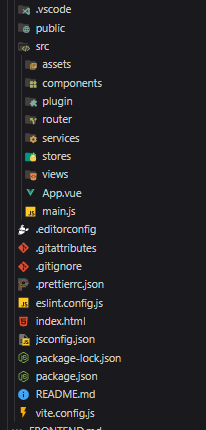

# Para criar um projeto Vue com os padrões da Fábrica, siga os passos abaixo

---

## ✅ Checklist: Começando um novo projeto

!!! tip "1. Configurar suas Ferramentas"
    - Escolha as ferramentas que irá utilizar no projeto.
    - Decida qual será o sistema de estilização: `Tailwind`, `CSS`, `Vuetify`, etc.
    - Planeje qual arquitetura de pastas será utilizada.  
      > Embora exista uma estrutura padrão sugerida, isso pode variar de projeto para projeto.

!!! tip "2. Iniciar o Projeto"
    - Crie o projeto com `Vue CLI`, `Vite` ou outra ferramenta de sua escolha.
    - Defina as configurações iniciais:
        - Nome do projeto
        - Tipo de roteamento (usando `child routes`, `layouts/templates`, etc.)
        - Plugins ou bibliotecas padrão do time

---

## 🧰 Configuração das Ferramentas

### Como instalar o **Node.js** e **npm** de forma atualizada

#### 🔷 No Windows:
1. Acesse o site oficial: [https://nodejs.org](https://nodejs.org)
2. Baixe a versão **LTS (Long Term Support)**.
3. Execute o instalador e siga os passos padrão.
4. Após a instalação, abra o terminal e verifique:
    ```bash
    node -v
    npm -v
    ```

#### 🐧 No Linux (Ubuntu/Debian):`
1. Instale o `nvm` (Node Version Manager):
    ```bash
    curl -o- https://raw.githubusercontent.com/nvm-sh/nvm/v0.39.7/install.sh | bash
    ```

2. REINCIE O TERMINAL e Instale a versão LTS mais recente do Node:
    ```bash
    nvm install --lts
    ```

3. Verifique a instalação:
    ```bash
    node -v
    npm -v
    ```

---

Depois de suas ferramentas estarem instaladas, você pode ir para o proximo passo de realmente iniciar seu projeto Vue.


## 🛠️ Criando um novo projeto Vue

### 1. Criando um novo projeto Vue com Vite

- Comando para criar um novo projeto Vue com Vite:
```bash
npm init vue@latest .
```

Após isso, você será solicitado a escolher algumas opções para o seu projeto. Coloque estas opcoes que usamos aqui, algumas podem não ser necessárias para o seu projeto, mas é bom já deixar tudo configurado:

```bash
✔ Project name: (nome-do-projeto-todo-minusculo)
✔ Add TypeScript? › ❌ Não
✔ Add JSX? › ❌ Não
✔ Add Vue Router for SPA development? › ✅ Sim
✔ Add Pinia for state management? › ✅ Sim
✔ Add Vitest for Unit Testing? › ✅ Sim
✔ Add an end-to-end testing framework? › ❌ Não
✔ Add ESLint for code quality? › ✅ Sim
✔ Add Prettier for code formatting? › ✅ Sim
```

- Comando para instalar as dependências do projeto: 
```bash
npm i
```

---

### 2. 'Limpeza' do projeto

Quando criado o projeto vue vem com algumas coisas que não são necessárias para o projeto, então vamos remover algumas delas:

- Remover o todos os componentes existentes na pasta `src/components/`;
- Remover as views existentes na pasta `src/views/`, exeto a `HomeView.vue`;
- Editar o arquivo `src/router/index.js` para remover as rotas que não são necessárias, mantendo apenas a rota da `HomeView.vue`;
- Remover o arquivo `src/assets/base.css`, e apagar todo conteudo do arquivo `src/assets/main.css`;
- Editar o arquivo `src/App.vue` para remover os componentes que não são necessários, mantendo apenas o `<router-view />`;
- Por fim adicione isso no seu `src/assets/main.css`, para zerar os paddings e margins de todos os elementos:

```css
*{ 
    margin: 0;
    padding: 0;
    box-sizing: border-box;
}
```

Assim, seu projeto estará limpo e pronto para começar a desenvolver.

## 🧼 Preparando o Projeto para o Desenvolvimento

Com o ambiente criado e as ferramentas configuradas, seu projeto estará **limpo e pronto para iniciar o desenvolvimento**.

Antes de escrever qualquer linha de código, é fundamental entender a **estrutura padrão de pastas** que utilizamos na Fábrica. Essa estrutura foi pensada para organizar bem o projeto, separando responsabilidades e facilitando a manutenção e escalabilidade.

### 🧱 Camadas da Estrutura

Na Fábrica, seguimos um padrão baseado em **três camadas principais** até chegar aos componentes de interface. São elas:

#### 🔌 1. Plugins

A camada de **Plugins** é o ponto mais próximo da interação com o backend.  
Nela, centralizamos a configuração da variável `api`, que deve ter seu valor definido em um arquivo `.env`.

Nesta camada você pode:
- Configurar e interceptar requisições (como autenticação por token).
- Adicionar logs, mensagens de erro ou controle de headers.
- Criar instâncias personalizadas do `axios`.

#### 🔧 2. Services

Na camada de **Services**, implementamos de fato as requisições à API:

- Métodos como `GET`, `POST`, `PUT`, `DELETE`, entre outros.
- Funções específicas para comunicação com endpoints.
- Eventuais transformações ou filtros antes do envio dos dados.

Essa camada serve como um intermediário entre os plugins e as stores.

#### 🍍 3. Stores

A camada de **Stores** é responsável por:
- Gerenciar o estado da aplicação.
- Armazenar dados que vêm da API.
- Tratar e organizar os dados para os componentes.
- Fazer chamadas às funções da camada de *services* e reagir aos seus resultados.

Utilizamos bibliotecas como `Pinia` para construir essa estrutura de forma reativa e escalável.

---

## 🗂️ Estrutura Inicial de Pastas

Agora que você compreendeu o papel de cada camada, é hora de criar a estrutura de diretórios do projeto.  
Crie as seguintes pastas na raiz do seu projeto, conforme sugerido:
ugerido na foto abaixo:

