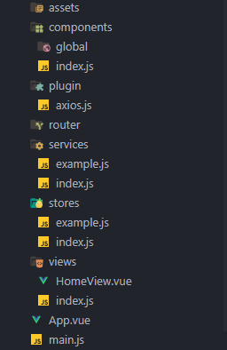

# Para criar um projeto Vue com os padrões da Fábrica, siga os passos abaixo

---

## ✅ Checklist: Começando um novo projeto

!!! tip "1. Configurar suas Ferramentas"
    - Escolha as ferramentas que irá utilizar no projeto.
    - Decida qual será o sistema de estilização: `Tailwind`, `CSS`, `Vuetify`, etc.
    - Planeje qual arquitetura de pastas será utilizada.  
      > Embora exista uma estrutura padrão sugerida, isso pode variar de projeto para projeto.

!!! tip "2. Iniciar o Projeto"
    - Crie o projeto com `Vue CLI`, `Vite` ou outra ferramenta de sua escolha.
    - Defina as configurações iniciais:
        - Nome do projeto
        - Tipo de roteamento (usando `child routes`, `layouts/templates`, etc.)
        - Plugins ou bibliotecas padrão do time

---

## 🧰 Configuração das Ferramentas

### Como instalar o **Node.js** e **npm** de forma atualizada

#### 🔷 No Windows:
1. Acesse o site oficial: [https://nodejs.org](https://nodejs.org)
2. Baixe a versão **LTS (Long Term Support)**.
3. Execute o instalador e siga os passos padrão.
4. Após a instalação, abra o terminal e verifique:
    ```bash
    node -v
    npm -v
    ```

#### 🐧 No Linux (Ubuntu/Debian):`
1. Instale o `nvm` (Node Version Manager):
    ```bash
    curl -o- https://raw.githubusercontent.com/nvm-sh/nvm/v0.39.7/install.sh | bash
    ```

2. REINCIE O TERMINAL e Instale a versão LTS mais recente do Node:
    ```bash
    nvm install --lts
    ```

3. Verifique a instalação:
    ```bash
    node -v
    npm -v
    ```

---

Depois de suas ferramentas estarem instaladas, você pode ir para o proximo passo de realmente iniciar seu projeto Vue.


## 🛠️ Criando um novo projeto Vue

### 1. Criando um novo projeto Vue com Vite

- Comando para criar um novo projeto Vue com Vite:
```bash
npm init vue@latest .
```

Após isso, você será solicitado a escolher algumas opções para o seu projeto. Coloque estas opcoes que usamos aqui, algumas podem não ser necessárias para o seu projeto, mas é bom já deixar tudo configurado:

```bash
✔ Project name: (nome-do-projeto-todo-minusculo)
✔ Add TypeScript? › ❌ Não
✔ Add JSX? › ❌ Não
✔ Add Vue Router for SPA development? › ✅ Sim
✔ Add Pinia for state management? › ✅ Sim
✔ Add Vitest for Unit Testing? › ✅ Sim
✔ Add an end-to-end testing framework? › ❌ Não
✔ Add ESLint for code quality? › ✅ Sim
✔ Add Prettier for code formatting? › ✅ Sim
```

- Comando para instalar as dependências do projeto: 
```bash
npm i
```

---

### 2. 'Limpeza' do projeto

Quando criado o projeto vue vem com algumas coisas que não são necessárias para o projeto, então vamos remover algumas delas:

- Remover o todos os componentes existentes na pasta `src/components/`;
- Remover as views existentes na pasta `src/views/`, exeto a `HomeView.vue`;
- Editar o arquivo `src/router/index.js` para remover as rotas que não são necessárias, mantendo apenas a rota da `HomeView.vue`;
- Remover o arquivo `src/assets/base.css`, e apagar todo conteudo do arquivo `src/assets/main.css`;
- Editar o arquivo `src/App.vue` para remover os componentes que não são necessários, mantendo apenas o `<router-view />`;
- Por fim adicione isso no seu `src/assets/main.css`, para zerar os paddings e margins de todos os elementos:

```css
*{ 
    margin: 0;
    padding: 0;
    box-sizing: border-box;
}
```

Assim, seu projeto estará limpo e pronto para começar a desenvolver.

## 🧼 Preparando o Projeto para o Desenvolvimento

Com o ambiente criado e as ferramentas configuradas, seu projeto estará **limpo e pronto para iniciar o desenvolvimento**.

Antes de escrever qualquer linha de código, é fundamental entender a **estrutura padrão de pastas** que utilizamos na Fábrica. Essa estrutura foi pensada para organizar bem o projeto, separando responsabilidades e facilitando a manutenção e escalabilidade.

### 🧱 Camadas da Estrutura

Na Fábrica, seguimos um padrão baseado em **três camadas principais** até chegar aos componentes de interface. São elas:

#### 🔌 1. Plugins

A camada de **Plugins** é o ponto mais próximo da interação com o backend.  
Nela, centralizamos a configuração da variável `api`, que deve ter seu valor definido em um arquivo `.env`.

Nesta camada você pode:
- Configurar e interceptar requisições (como autenticação por token).
- Adicionar logs, mensagens de erro ou controle de headers.
- Criar instâncias personalizadas do `axios`.

#### 🔧 2. Services

Na camada de **Services**, implementamos de fato as requisições à API:

- Métodos como `GET`, `POST`, `PUT`, `DELETE`, entre outros.
- Funções específicas para comunicação com endpoints.
- Eventuais transformações ou filtros antes do envio dos dados.

Essa camada serve como um intermediário entre os plugins e as stores.

#### 🍍 3. Stores

A camada de **Stores** é responsável por:
- Gerenciar o estado da aplicação.
- Armazenar dados que vêm da API.
- Tratar e organizar os dados para os componentes.
- Fazer chamadas às funções da camada de *services* e reagir aos seus resultados.

Utilizamos bibliotecas como `Pinia` para construir essa estrutura de forma reativa e escalável.

---

## 🗂️ Estrutura Inicial de Pastas

Agora que você compreendeu o papel de cada camada, é hora de criar a estrutura de diretórios do projeto.  
Crie as seguintes pastas na raiz do seu projeto, conforme sugerido:
na foto abaixo:

- Estrutura de pastas sugerida:


- Arquivos padrões:



Vemos que dentro de cada uma das pastas anteriores se tem um arquivo `index.js`, que serve para exportar os módulos daquela camada, ou seja, vamos importar tudo que precisamos daquela pasta pro index, e quando preicisar importar algo daquela camada, vamos importar do index, assim fica mais organizado e fácil de entender.
E também dentro da pasta `plugin` temos o arquivo axios.js, que é o arquivo onde vamos configurar o axios, que iremos tratar as requisições.

E aqui temos os exemplos de como é o padrao sugerido de cada tipo de arquivo:

## Exemplo de arquivo `axios.js` dentro da pasta `plugin`

```javascript
import axios from "axios";
import { useLoadingStore } from "@/stores";

const API_URL = import.meta.env.VITE_API_URL;

const api = axios.create({
  baseURL: API_URL 
});

// NAO OBRIGATÓRIO, MAS RECOMENDADO
// Aqui temos como usar interceptors do axios para lidar com as requisições, ele ve quando se inicia e acaba uma requisição, e podemos usar isso para mostrar um loading na tela, por exemplo.
api.interceptors.request.use((config) => {
  const loadingStore = useLoadingStore();
  loadingStore.startLoading();
  return config;
});

api.interceptors.response.use(
  (response) => {
    const loadingStore = useLoadingStore();
    loadingStore.stopLoading();
    return response;
  },
  (error) => {
    const loadingStore = useLoadingStore();
    loadingStore.stopLoading();
    return Promise.reject(error);
  }
);


export default api;
```

Depois da plugin configurada, você pode importar o `api` em qualquer lugar do seu projeto, como por exemplo no arquivo `index.js` da pasta `services`, para fazer as requisições.

## Exemplo de arquivo dentro da pasta `services`

```javascript
import api from '../../plugins/api'

/**
 * Service class for handling organs related operations.
 */
class OrganService {
  /**
   * Retrieves all organs.
   * @returns {Promise<Array>} A promise that resolves to an array of organs.
   * @throws {Error} If an error occurs while retrieving the organs.
   */
  async getOrgans() {
    try {
      const { data } = await api.get(`/organs`)
      return data.results
    } catch (error) {
      console.log('error in getOrgans', error)
      throw error
    }
  }

  /**
   * Retrieves all organs.
   * @returns {Promise<Array>} A promise that resolves to an array of organs filtered by systems.
   * @throws {Error} If an error occurs while retrieving the organs.
   */
    async getOrgansBySystem(systemId) {
      try {
        const { data } = await api.get(`/organs/?page=1&system_id=${systemId}`)
        return data.results
      } catch (error) {
        console.log('error in getOrgans', error)
        throw error
      }
    }

    async getOrgansById(organ_id) {
      try {
        const { data } = await api.get(`/organs/${organ_id}/`)
        return data
      } catch (error) {
        console.log('error in getOrgansById', error)
        throw error
      }
    }

  /**
   * Creates a new organs.
   * @param {Object} newSpecie - The new organs object to create.
   * @returns {Promise<Object>} A promise that resolves to the created organs object.
   * @throws {Error} If an error occurs while creating the organs.
   */
  async createOrgan(newOrgan) {
    try {
      const { data } = await api.post(`/organs/`, newOrgan)
      return data.results
    } catch (error) {
      console.log('error in createOrgans', error)
      throw error
    }
  }

  /**
   * Updates an existing organs.
   * @param {Object} specie - The organs object to update.
   * @returns {Promise<Object>} A promise that resolves to the updated organs object.
   * @throws {Error} If an error occurs while updating the organs.
   */
  async updateOrgans(organ) {
    try {
      const { data } = await api.put(`/organs/${organ.id}/`, organ)
      return data.results
    } catch (error) {
      console.log('error in updateOrgans')
      throw error
    }
  }

  /**
   * Deletes a organs by its ID.
   * @param {number} id - The ID of the organs to delete.
   * @returns {Promise<Object>} A promise that resolves to the deleted organs object.
   * @throws {Error} If an error occurs while deleting the organs.
   */
  async deleteOrgans(id) {
    try {
      const { data } = await api.delete(`/organ/${id}/`)
      return data.results
    } catch (error) {
      console.log('error in deleteOrgan', error)
      throw error
    }
  }
}

export default new OrganService()
```

## Exemplo de arquivo dentro da pasta `stores`

```javascript
import { defineStore } from 'pinia'
import { computed } from 'vue'
import { OrganService } from '@/services'
import { useStorage } from '@vueuse/core'

/**
 * Store for managing organs data.
 * @typedef {Object} SpecieStore
 * @property {Object} state - The state object containing organs data.
 * @property {Array} state.species - The array of organs.
 * @property {Object|null} state.selectedSpecie - The currently selected organ.
 * @property {boolean} state.loading - Indicates if data is currently being loaded.
 * @property {Error|null} state.error - The error object, if any.
 * @property {boolean} isLoading - Computed property indicating if data is currently being loaded.
 * @property {number} speciesCount - Computed property indicating the number of organs.
 * @property {Function} getSpecies - Function to fetch organs data.
 * @property {Function} createSpecie - Function to create a new specie.
 * @property {Function} updateSpecie - Function to update an existing organ.
 * @property {Function} deleteSpecie - Function to delete a organ.
 */

/**
 * Creates a new instance of the OrganStore.
 * @function useSpecieStore
 * @returns {SpecieStore} The OrganStore instance.
 */
export const useOrganStore = defineStore('organ', () => {
  const state = useStorage('organStorage', {
    organs: [],
    selectedOrgan: {},
    organsBySystem: [],
    loading: false,
    error: null,
    connection: false
  })

  const organs = computed(() => state.value.organs)
  const organsBySystem = computed(() => state.value.organsBySystem)
  const selectedOrgan = computed(()=> state.value.selectedOrgan)
  const isLoading = computed(() => state.value.loading)
  const organsCount = computed(() => state.value.organs.length)

  /**
   * Fetches organs data.
   * @async
   * @function getSpecies
   */
  const getOrgans = async () => {
    state.value.loading = true
    try {
      state.value.organs = await OrganService.getOrgans()
    } catch (error) {
      state.value.error = error
    } finally {
      state.value.loading = false
      state.value.connection = true
    }
  }

   /**
   * Fetches organs data.
   * @async
   * @function getOrgansBySystem
   */
   const getOrgansBySystem = async (systemId) => {
    state.value.loading = true
    try {
      const response = await OrganService.getOrgansBySystem(systemId)   
      state.value.organsBySystem = response
    } catch (error) {
      state.value.error = error
    } finally {
      state.value.loading = false
      state.value.connection = true
    }
  }

  const getOrgansById = async (organId) => {
    state.value.loading = true
    try {
      const response = await OrganService.getOrgansById(organId)   
      state.value.selectedOrgan = response
    } catch (error) {
      state.value.error = error
    } finally {
      state.value.loading = false
      state.value.connection = true
    }
  }

  /**
   * Creates a new organ.
   * @async
   * @function createSpecie
   * @param {Object} newSpecie - The new organ object to create.
   */
  const createOrgan = async (newOrgan) => {
    state.value.loading = true
    try {
      state.value.organs.push(await OrganService.createOrgan(newOrgan))
    } catch (error) {
      state.value.error = error
    } finally {
      state.value.loading = false
    }
  }

  /**
   * Updates an existing organ.
   * @async
   * @function updateSpecie
   * @param {Object} specie - The organ object to update.
   */
  const updateOrgan = async (organ) => {
    state.value.loading = true
    try {
      const index = state.value.organs.findIndex((s) => s.id === organ.id)
      state.value.organs[index] = await OrganService.getOrgans()
    } catch (error) {
      state.value.error = error
    } finally {
      state.value.loading = false
    }
  }
  /**
   * Deletes a organ.
   * @async
   * @function deleteSpecie
   * @param {number} id - The ID of the organ to delete.
   */
  const deleteOrgan = async (id) => {
    state.value.loading = true
    try {
      const index = state.value.organs.findIndex((s) => s.id === id)
      state.value.organs.splice(index, 1)
    } catch (error) {
      state.value.error = error
    } finally {
      state.value.loading = false
    }
  }

  return {
    state,
    isLoading,
    organsCount,
    organs,
    organsBySystem,
    selectedOrgan,
    getOrgansBySystem,
    getOrgans,
    getOrgansById,
    createOrgan,
    updateOrgan,
    deleteOrgan
  }
})
```

## Exemplo de arquivo dentro da pasta `views`

```js
import NewsService from './portal/news'
import MembersService from './portal/members'
import ProjectsService from './portal/projects'
import AreasService from './portal/areas'

export { NewsService, MembersService, ProjectsService, AreasService }
```

## Exemplo de arquivo `index.js` dentro da pasta `stores`

```javascript
import { useNewsStore } from './portal/news'
import { useMembersStore } from './portal/members'
import { useProjectsStore } from './portal/projects'
import { useLoadingStore } from './loading'
import { useAreasStore } from './portal/areas'

export { useNewsStore, useMembersStore, useProjectsStore, useLoadingStore, useAreasStore }
```

A estrutura de componentes e views pode variar de acordo com as particularidades de cada projeto — como estilo, organização dos componentes, bibliotecas utilizadas, ordem dos elementos, entre outros.

No entanto, algumas diretrizes são recomendadas:

Múltiplas stores: caso o projeto utilize mais de uma store, importe todas no index.ts (ou index.js) da respectiva pasta e, a partir dele, distribua para os componentes que precisarem.

Views: o ideal é que as views sejam responsáveis apenas por importar e compor componentes. Evite realizar estilizações, lógicas complexas ou criar novos elementos diretamente dentro das views.

## ✅ Conclusão

!!! note "Encerramento e Boas Práticas"
    Seguindo este guia, você terá uma base sólida e padronizada para iniciar projetos Vue dentro da Fábrica.  
    Desde a criação do projeto com ferramentas modernas como Vite, até a organização em camadas (`plugins`, `services`, `stores` e `views`), cada etapa foi pensada para garantir **escalabilidade**, **clareza** e **facilidade de manutenção** do código.

    Manter essa estrutura consistente entre os projetos promove a colaboração entre desenvolvedores e facilita o onboarding de novos membros da equipe.

    > O mais importante não é seguir cada regra ao pé da letra, mas **entender o propósito de cada escolha** e adaptá-la conforme a realidade do seu projeto.

    **Boas práticas constroem bons projetos.** 🚀
